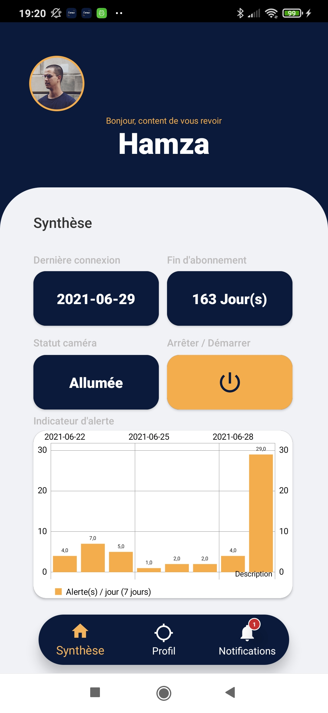
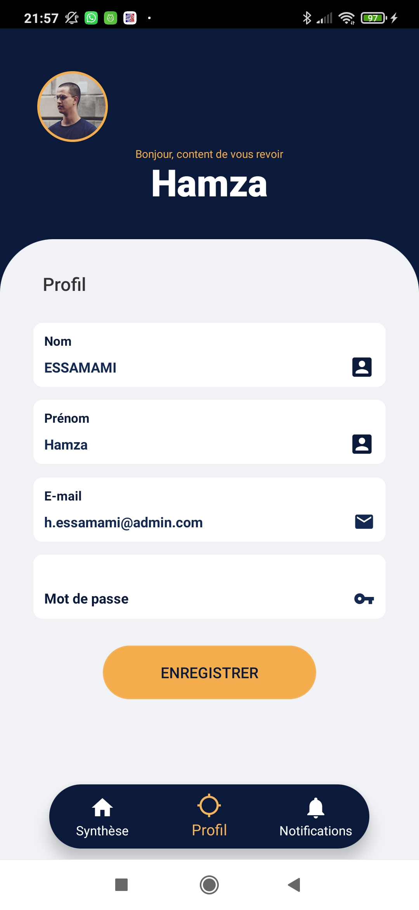

# **PA - Project : ThefThor** :rotating_light:

Many thefts take place in supermarkets or
supermarkets or in shops in general, which
which causes them to lose money. To remedy this
cameras have been installed, but a security guard cannot have
security guard cannot have eyes everywhere to see
everywhere to see all the thefts.

Install cameras capable streaming data so that they can be used with 
machine learning to label the scene (classification of videos) and know 
if a theft has occurred / is in progress to finally notify the security 
guard on his smartphone.

### **Members** :construction_worker:
- NEZONDET-RENAUD Nathanael
- SIMON Arnaud
- ESSAMAMI Hamza

### **How to use** :bulb:

Android app to install on your mobile phone (android)
Currently in build...

### **UI / UX Design** :fire:
`Launcher`

`Sign-in Screen`

`Board Screen`

`Profil Screen`

### **Contributing** :lock:
Pull requests are welcome. For major changes, please open an issue first 
to discuss what you would like to change.

Please make sure to update tests as appropriate.
